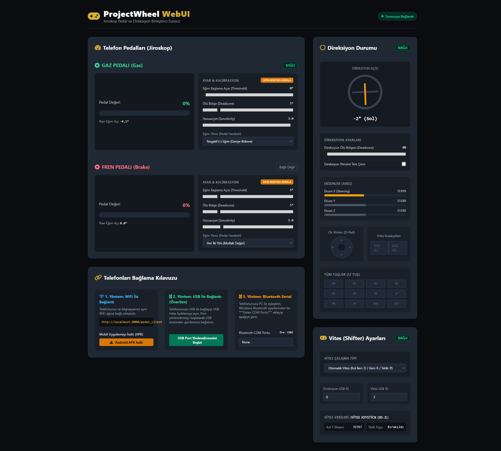
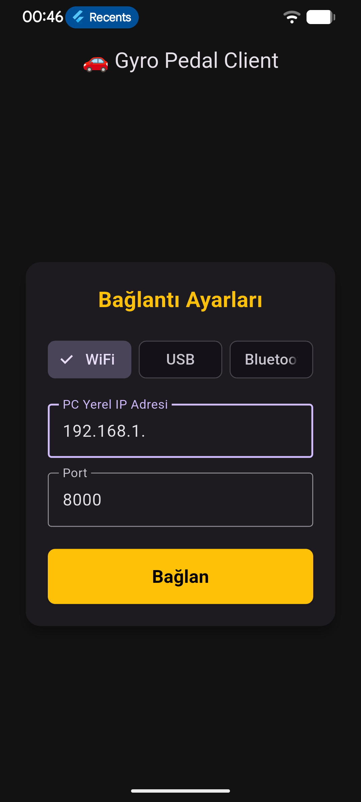
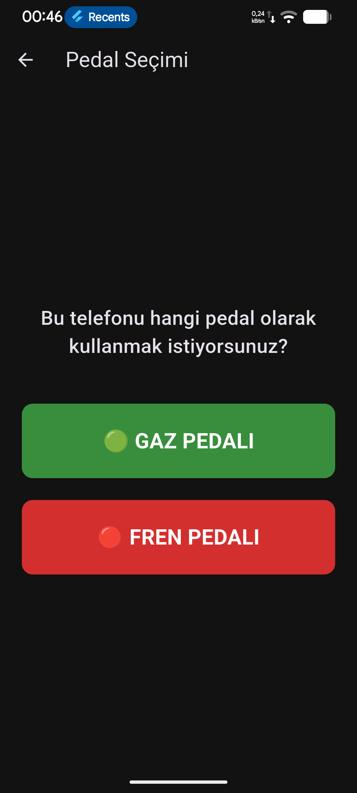
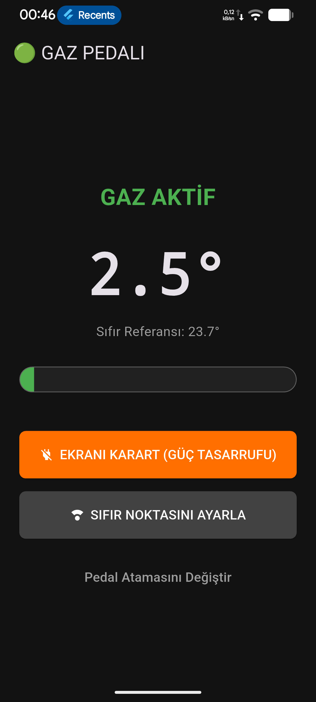
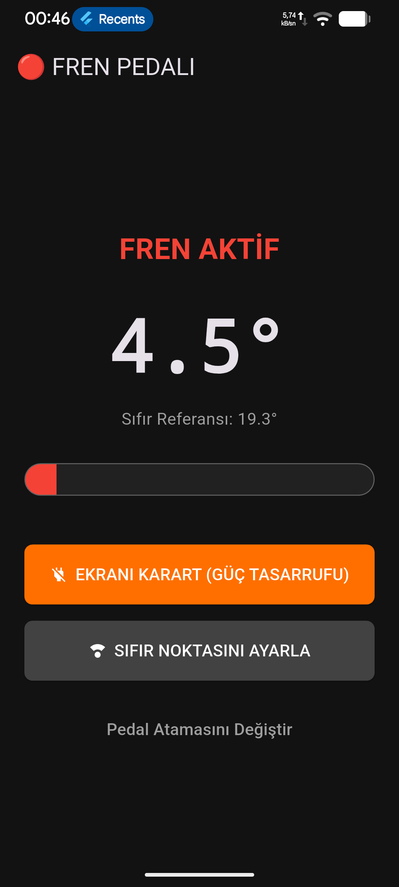

<p align="center">
  <a href="README.md"></a>
  <a href="README.en.md"></a>
</p>

# ProjectWheel — Gyro Pedal & Steering Wheel Gamepad

An integrated driver system that turns the gyroscope (accelerometer) data of two Android phones into a **virtual Xbox 360 gamepad** (gas/brake pedals + steering wheel) on a computer.

By mounting the phones to the floor or a driving rig and tilting them, you control the **gas** and **brake** pedals, while a physical steering wheel is reflected to the game as the **X** axis. The connection can be established over **WiFi**, **USB (ADB)**, or **Bluetooth Classic (Serial SPP)**.

## Features

- **Dual-phone support** — one phone is assigned as the gas pedal, the other as the brake pedal.
- **Three connection methods**
  - **WiFi** — phone and computer on the same network.
  - **USB (ADB)** — low latency via `adb reverse`.
  - **Bluetooth Classic (Serial SPP)** — wireless via a Windows "Incoming COM Port".
- **Physical power-button (screen-off) support** — Android Foreground Service + Partial Wake Lock keep sensor reading and data transmission uninterrupted even while the screen is off.
- **Remote calibration (Set Zero Point)** — zero the pedals with a single click from the WebUI.
- **Deadzone, sensitivity, activation point, and tilt-direction settings** — separate for gas and brake.
- **Steering deadzone** and smooth scaling.
- **Live WebUI control panel** — pedal/steering status, axis values, calibration.

## Screenshots

### 💻 WebUI Control Panel
<p align="left">
  
</p>

### 📱 Mobile Client Flow
<p align="left">
  
  
  
  
</p>

## Technology Stack

| Layer | Technology |
|-------|------------|
| Mobile app | Flutter (Dart) |
| Sensor reading | `sensors_plus` (accelerometer) |
| Background service | `flutter_background` + `wakelock_plus` |
| Bluetooth | `flutter_blue_classic` (RFCOMM/SPP) |
| Networking | `web_socket_channel` (WebSocket) |
| Server | Python + FastAPI + Uvicorn |
| Virtual gamepad | `vgamepad` (ViGEm) |
| Serial port (Bluetooth) | `pyserial` |
| Physical wheel reading | `ctypes` + Win32 `winmm.dll` |

## Project Structure

```
.
├── backend_app.py           # FastAPI server (gamepad + WebSocket + serial)
├── run_backend.bat          # Windows launcher script
├── build_apk.bat            # Flutter APK build script
├── settings.json            # Runtime settings
├── requirements.txt         # Python dependencies
├── templates/
│   ├── dashboard.html       # WebUI control panel
│   └── pedal.html           # Phone web client (optional)
└── gyro_pedal_app/          # Flutter mobile app
    ├── lib/main.dart        # Main app code
    ├── pubspec.yaml
    └── android/             # Android platform files
```

## Installation

### 1. Computer (Backend)

Requirements:
- **Windows 10/11**
- **Python 3.9+**
- **ViGEmBus** driver (for the virtual gamepad): https://github.com/nefarius/ViGEmBus/releases

```bash
pip install -r requirements.txt
```

Start the server:

```bat
run_backend.bat
```

Then open the control panel in your browser: **http://localhost:8000**

### 2. Phone (Flutter App)

```bash
cd gyro_pedal_app
flutter pub get
flutter build apk --release
```

Generated APK: `gyro_pedal_app/build/app/outputs/flutter-apk/app-release.apk`

> You can download the ready-made APK directly while the backend is running:
> **http://localhost:8000/download/gyro-pedal.apk**

## Connection Guide

### WiFi
1. Connect the phone and computer to the same network.
2. In the app, select **WiFi** and enter the computer's local IP (e.g. `192.168.1.100`).
3. Tap **Connect** and assign the pedals.

### USB (ADB)
1. Enable USB Debugging on the phone.
2. `adb reverse tcp:8000 tcp:8000` is set up automatically while `run_backend.bat` is running.
3. Select **USB** mode in the app.

### Bluetooth Classic (Serial SPP)
1. Pair the phone with the computer over Bluetooth.
2. On Windows: create an incoming COM port via *Bluetooth Settings → More Bluetooth Options → COM Ports → Add → "Incoming"* (e.g. `COM3`).
3. Enter that port in the **Bluetooth COM Port** field in the WebUI.
4. In the app, select **Bluetooth** and choose your computer from the list.

## Data Sources & Disclaimer

This project runs entirely **locally** and does not depend on any third-party API. All sensor data comes from the user's own phones and stays within the local network. Virtual gamepad emulation is performed via the ViGEmBus driver; usage is intended for legitimate simulation/gaming purposes only.

## License

This project is licensed under the [MIT License](LICENSE).

## Changelog

See [CHANGELOG.md](CHANGELOG.md) for the detailed version history.
